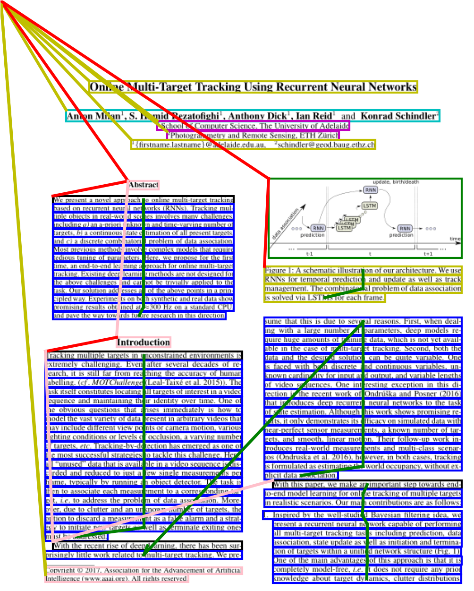
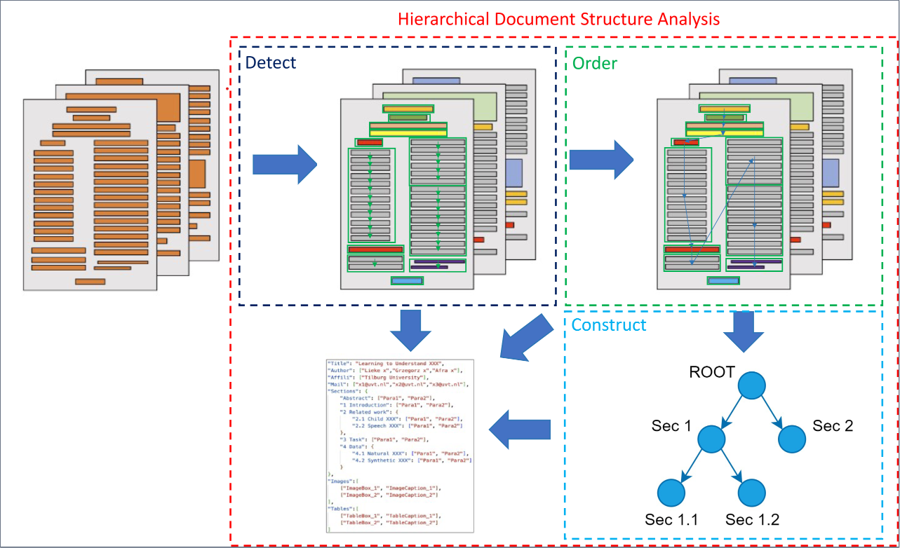
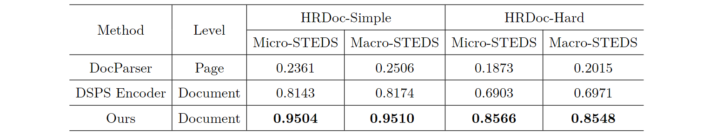
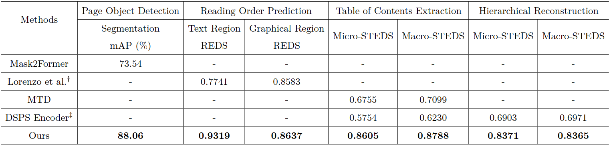

# CompHRDoc

Comp-HRDoc is the first comprehensive benchmark, specifically designed for hierarchical document structure analysis. It encompasses tasks such as page object detection, reading order prediction, table of contents extraction, and hierarchical structure reconstruction. Comp-HRDoc is built upon the [HRDoc-Hard dataset](https://github.com/jfma-USTC/HRDoc), which comprises 1,000 documents for training and 500 documents for testing. We retain all original images without modification and extend the original annotations to accommodate the evaluation of these included tasks.

## News

- **We released the annotations of the Comp-HRDoc benchmark, please refer to [`CompHRDoc.zip`](./CompHRDoc.zip).**
- **We released the evaluation tool of the Comp-HRDoc benchmark, please refer to [`evaluation`](evaluation/) folder.**
- **We released the original paper, [Detect-Order-Construct: A Tree Construction based Approach for Hierarchical Document Structure Analysis](https://arxiv.org/pdf/2401.11874.pdf), to Arxiv.**

## Introduction

Document Structure Analysis (DSA) is a comprehensive process that identifies the fundamental components within a document, encompassing headings, paragraphs, lists, tables, and figures, and subsequently establishes the logical relationships and structures of these components. This process results in a structured representation of the document’s physical layout that accurately mirrors its logical structure, thereby enhancing the effectiveness and accessibility of information retrieval and processing. In a contemporary digital landscape, the majority of mainstream documents are structured creations, crafted using hierarchical-schema authoring software such as LaTeX, Microsoft Word, and HTML. Consequently, Hierarchical Document Structure Analysis (HDSA), which focuses on extracting and reconstructing the inherent hierarchical structures within these document layouts, has gained significant attention. Previous datasets primarily focus on specific sub-tasks of DSA, such as Page Object Detection, Reading Order Prediction, and Table of Contents (TOC) Extraction, among others. Despite the substantial progress achieved in these individual sub-tasks, there remains a gap in the research community for a comprehensive end-to-end system or benchmark that addresses all aspects of document structure analysis concurrently. Leveraging the HRDoc dataset, we establish a comprehensive benchmark, Comp-HRDoc, aimed at evaluating page object detection, reading order prediction, table of contents extraction, and hierarchical structure reconstruction concurrently.

<!--  -->


### Data Directory Structure

```plaintext
Comp-HRDoc/
├── HRDH_MSRA_POD_TRAIN/
│   ├── Images/ # put the document images of HRDoc-Hard training set into this folder
│   │   ├── 1401.6399_0.png
│   │   ├── 1401.6399_1.png
│   │   └── ...
│   ├── hdsa_train.json
│   ├── coco_train.json
│   ├── README.md # a detailed explanation of each file and folder
│   └── ...
└──HRDH_MSRA_POD_TEST/
    ├── Images/ # put the document images of HRDoc-Hard test set into this folder
    │   ├── 1401.3699_0.png
    │   ├── 1401.3699_1.png
    │   └── ...
    ├── test_eval/ # hierarchical document structure for evaluation
    │   ├── 1401.3699.json
    │   ├── 1402.2741.json
    │   └── ...
    ├── test_eval_toc/ # table of contents structure for evaluation
    │   ├── 1401.3699.json
    │   ├── 1402.2741.json
    │   └── ...
    ├── hdsa_test.json
    ├── coco_test.json
    ├── README.md # a detailed explanation of each file and folder
    └── ...
```

**For a detailed explanation of each file and folder, please refer to `datasets/Comp-HRDoc/HRDH_MSRA_POD_TRAIN/README.md` and `datasets/Comp-HRDoc/HRDH_MSRA_POD_TEST/README.md`.**

**Due to license restrictions, please go to [HRDoc-Hard dataset](https://github.com/jfma-USTC/HRDoc) to download the images of HRDoc-Hard and put them into the corresponding folders.**

### Evaluation Tool

To utilize the evaluation tool for assessing your model's performance on the Comp-HRDoc dataset, please consult the script located at [`evaluation/unified_layout_evaluation.py`](evaluation/unified_layout_evaluation.py).

Below is an example illustrating how to conduct an evaluation for the task of reconstructing the hierarchical document structure:
```python
hds_gt = "datasets/Comp-HRDoc/HRDH_MSRA_POD_TEST/test_eval/"
hds_pred = "path_to_your_predicted_hierarchical_structure/"
python evaluation/hrdoc_tool/teds_eval.py --gt_anno {hds_gt} --pred_folder {hds_pred}
```

We also provide some examples in [`evaluation/examples/`](evaluation/examples/) to demonstrate the format of predicted files required by the evaluation tool.

### Detect-Order-Construct

We proposed a comprehensive approach to thoroughly analyzing hierarchical document structures using a tree construction based method. This method decomposes tree construction into three distinct stages, namely Detect, Order, and Construct. Initially, given a set of document images, the Detect stage is dedicated to identifying all page objects and assigning a logical role to each object, thereby forming the nodes of the hierarchical document structure tree. Following this, the Order stage establishes the reading order relationships among these nodes, which corresponds to a pre-order traversal of the hierarchical document structure tree. Finally, the Construct stage identifies hierarchical relationships (e.g., Table of Contents) between semantic units to construct an abstract hierarchical document structure tree. By integrating the results of all three stages, we can effectively construct a complete hierarchical document structure tree, facilitating a more comprehensive understanding of complex documents.



## Results

### Hierarchical Document Structure Reconstruction on HRDoc


### End-to-End Evaluation on Comp-HRDoc


## Contributing

This project welcomes contributions and suggestions.  Most contributions require you to agree to a
Contributor License Agreement (CLA) declaring that you have the right to, and actually do, grant us
the rights to use your contribution. For details, visit https://cla.opensource.microsoft.com.

When you submit a pull request, a CLA bot will automatically determine whether you need to provide
a CLA and decorate the PR appropriately (e.g., status check, comment). Simply follow the instructions
provided by the bot. You will only need to do this once across all repos using our CLA.

This project has adopted the [Microsoft Open Source Code of Conduct](https://opensource.microsoft.com/codeofconduct/).
For more information see the [Code of Conduct FAQ](https://opensource.microsoft.com/codeofconduct/faq/) or
contact [opencode@microsoft.com](mailto:opencode@microsoft.com) with any additional questions or comments.

## 📝Citing

If you find this code useful, please consider to cite our work.

```
@article{wang2024detect,
  title={Detect-Order-Construct: A Tree Construction based Approach for Hierarchical Document Structure Analysis},
  author={Wang, Jiawei and Hu, Kai and Zhong, Zhuoyao and Sun, Lei and Huo, Qiang},
  journal={arXiv preprint arXiv:2401.11874},
  year={2024}
}
```